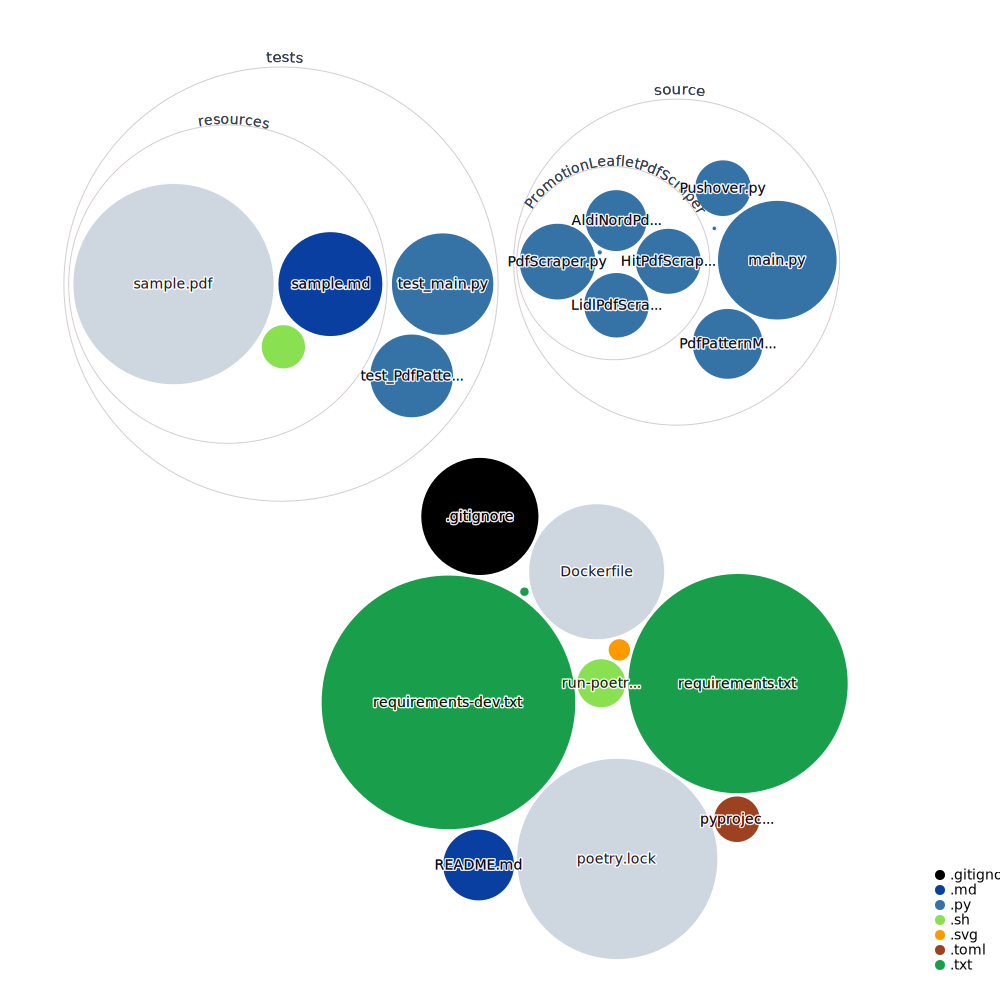

# supermarket-offer-scanner

# What is this?

Simple project to scan the **upcoming** special offers of supermarkets.
You can run this as a command line project or by cron inside a docker container.

Feel free to contribute more shops if required :-)

# How to use it with docker-compose?

```yml
services:
  supermarket-offer-scanner:
    image: ghcr.io/entepotenz/supermarket-offer-scanner:latest
    restart: unless-stopped
    environment:
      TZ: "Europe/London"
      PUID: "$PUID"
      PGID: "$PGID"
      PUSHOVER_USER_KEY: "$PUSHOVER_USER_KEY"
      PUSHOVER_TOKEN: "$PUSHOVER_TOKEN"
    volumes:
      - ./Docker/docker-cron/crontab-sample.txt:/config/crontab.txt
```

## How to display more context information for a match by using regex?

**keep this in mind:** the regex search is configured to be **always** case-insensitive

Modify the regex in this way:
`"[^\s]*\s*DEAL_STRING\s*[^\s]*"`

looking for zigbee devices would look like this:

```shell
python /app/source/main.py "lidl" --matchers "[^\s]*\s*zigbee\s*[^\s]*"
```

# How to build the docker container yourself?

Please take a look at those two folders:

- `Docker/docker-cron/`
    - run this command: `docker-compose up`
- `Docker/docker-one-shot/`
    - run the script (**warning** it is build in a way which makes sure the image is rebuild each time)
        - `Docker/docker-one-shot/build-and-run-and-remove-docker.sh`

# GitHub Next Code Visualization

[](https://mango-dune-07a8b7110.1.azurestaticapps.net/?repo=entepotenz%2Fsupermarket-offer-scanner)

# TODOs

- catch exceptions and send them by pushover